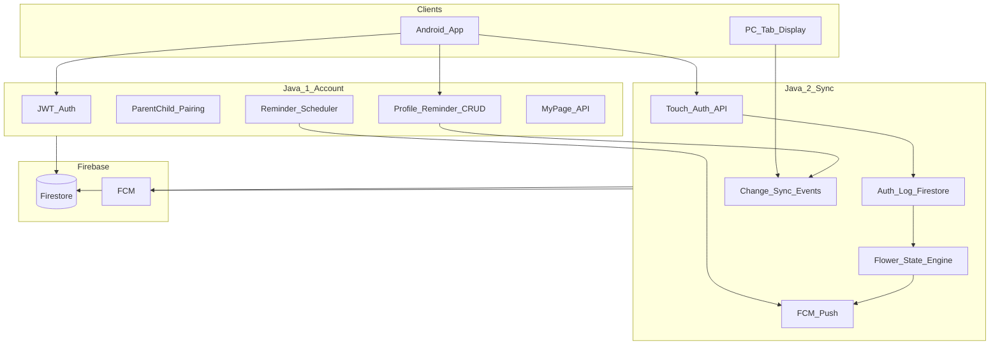

# AAC 아키텍처 — Java #1 / #2 경계



## 패키지 분할 (`apps/server`)

```
com.aac
├── account/          ← Java #1 ONLY
│   ├── controller/   AuthController, PairingController, MyPageController
│   ├── service/      AuthService, PairingService, ReminderScheduleService
│   ├── security/     JwtFilter, SecurityConfig
│   └── dto/
├── sync/             ← Java #2 ONLY
│   ├── controller/   AuthTouchController, SyncController, FlowerController
│   ├── service/      AuthLogService, FlowerStateService, SyncEventService
│   └── dto/
├── firebase/         ← 공통 (변경 시 양쪽 리뷰)
└── controller/       ← 기존 profile/reminder → Java #1이 account로 이전 예정
```

## 이벤트 계약 (양쪽 연동)

Java #1이 CRUD 후 **내부 이벤트** 발행 (Spring `ApplicationEvent`):

| 이벤트 | 발행 | 구독 |
|--------|------|------|
| `ReminderChangedEvent` | Java #1 | Java #2 → 탭 동기화 |
| `ProfileChangedEvent` | Java #1 | Java #2 |
| `AuthCompletedEvent` | Java #2 | Java #2 → 뉴스레터 FCM |
| `AuthMissedEvent` | Java #2 | Java #2 → 시듦 상태 |

Java #2는 Java #1 Controller를 **직접 수정하지 않음**.

## Firestore 컬렉션 소유

| Collection | Owner | 비고 |
|------------|-------|------|
| `users/{uid}` | Java #1 | profile |
| `users/{uid}/reminders` | Java #1 | |
| `pairings/{code}` | Java #1 | 부모-자녀 코드 |
| `users/{uid}/authLogs` | Java #2 | 터치 인증 기록 |
| `users/{uid}/flowerState` | Java #2 | healthy/withering/withered |
| `users/{uid}/newsletters` | Java #2 | push payload |
| `users/{uid}/devices` | 공통 | FCM token |

## API prefix

| Prefix | Owner |
|--------|-------|
| `/api/v1/auth/**` | Java #1 |
| `/api/v1/pairing/**` | Java #1 |
| `/api/v1/users/{uid}/**` (profile, reminders, mypage) | Java #1 |
| `/api/v1/sync/**` | Java #2 |
| `/api/v1/auth-touch/**` | Java #2 |
| `/api/v1/flower/**` | Java #2 |
